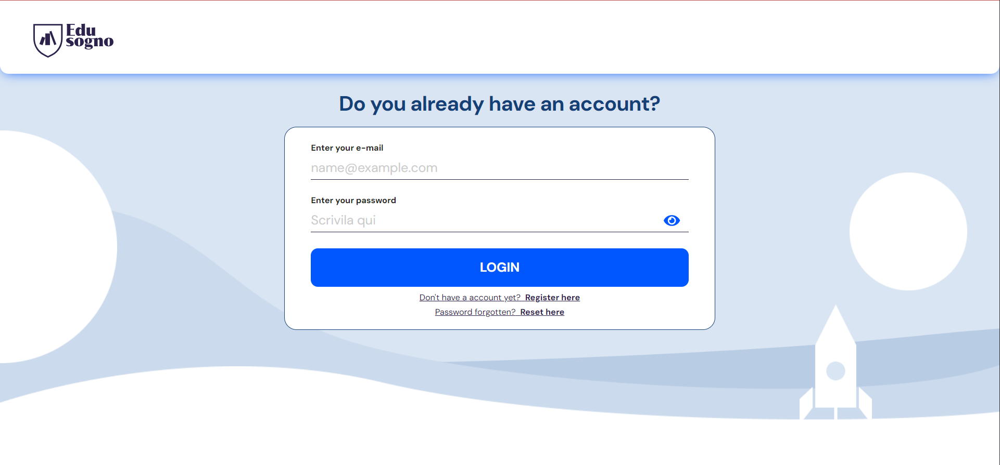
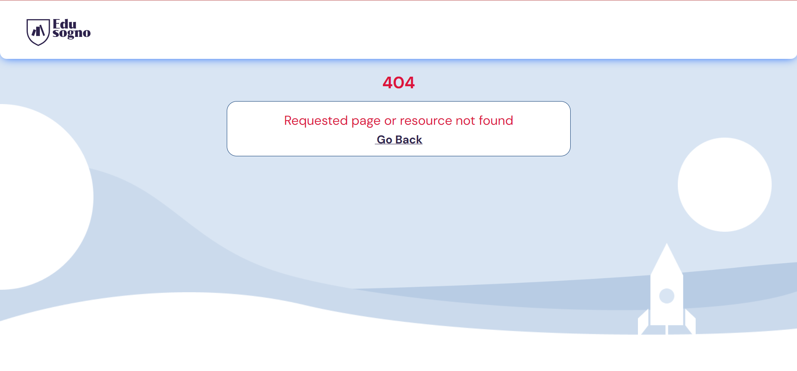
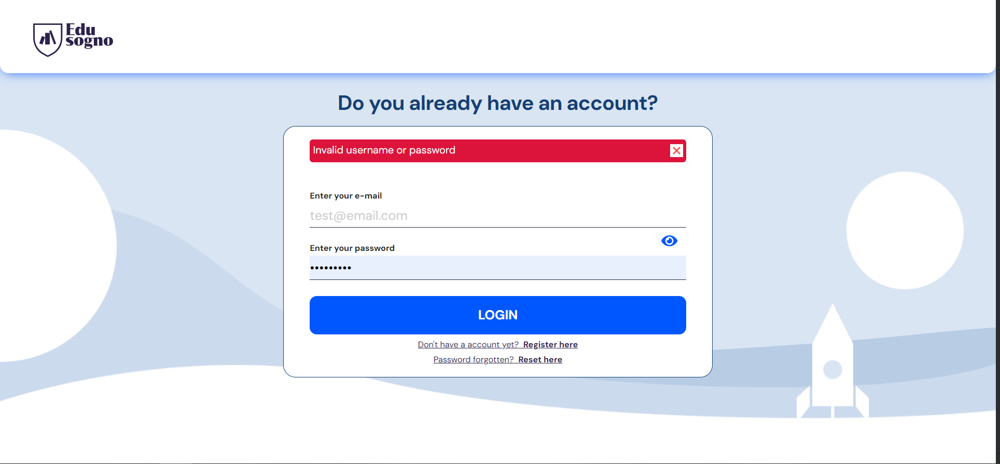
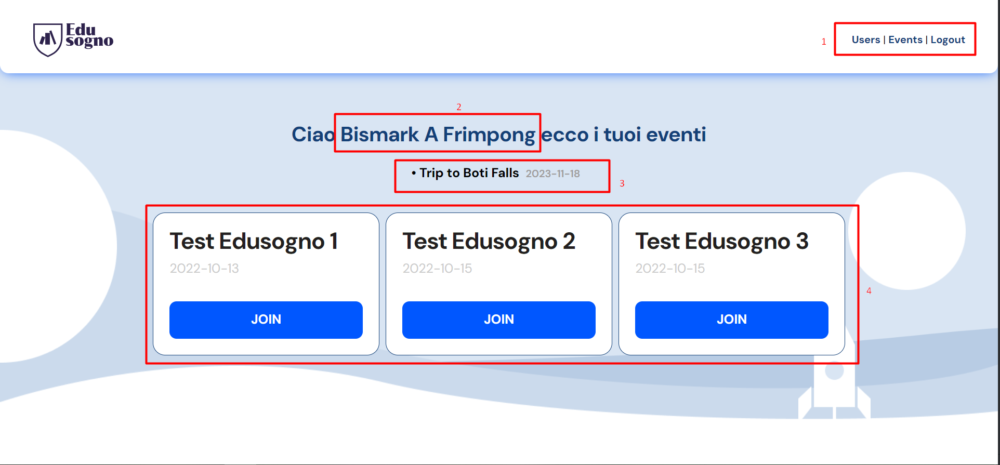
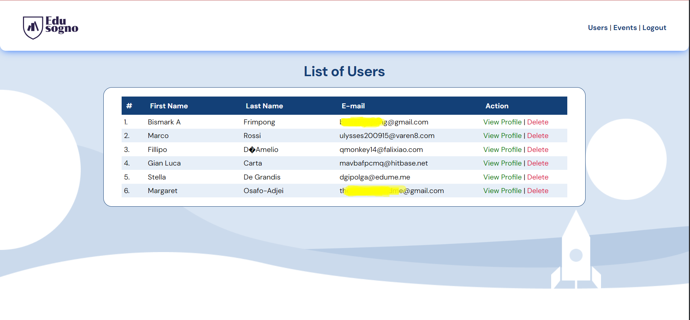
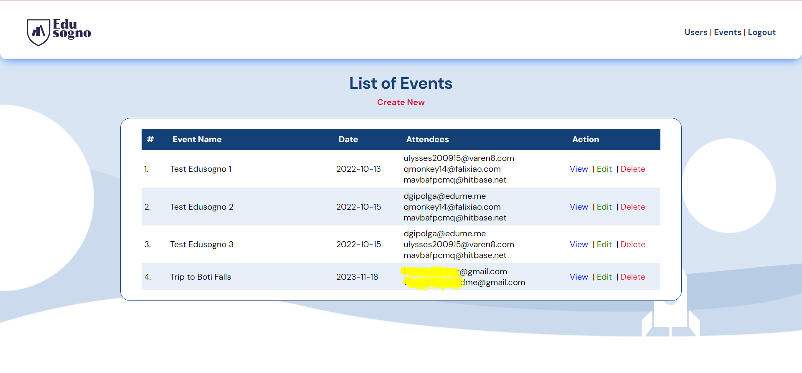
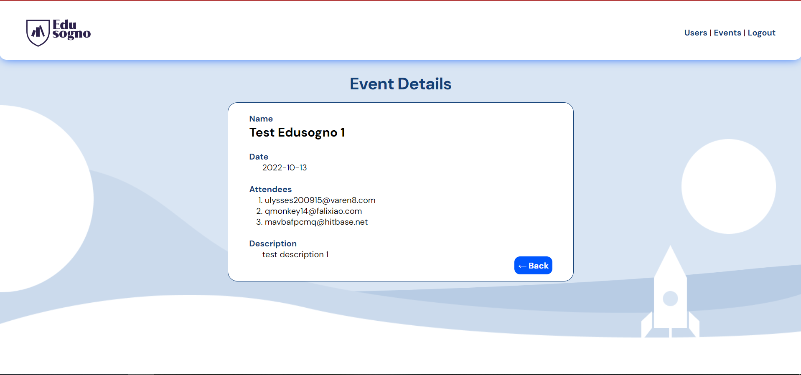
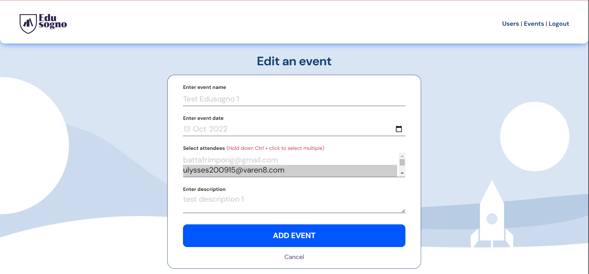
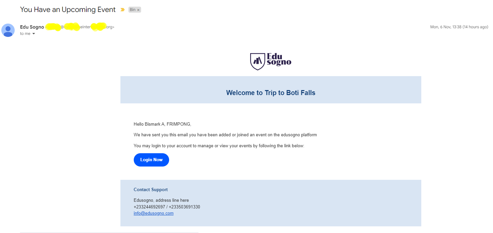
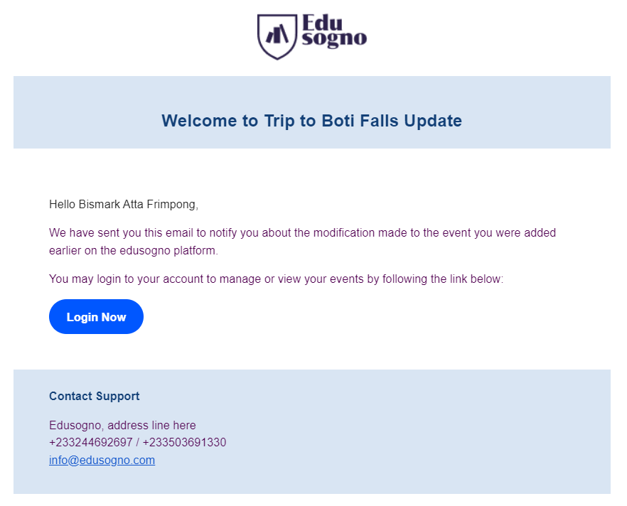

# Event Management Application

This project involves creating a basic task management application using
PHP, HTML, CSS, and JavaScript. The task is to build a web page where users
can register a new account, login, change account password, view, add,
edit, and delete events.

The exercise is structured in the following parts - detailed in more detail
below.

1) Creation of a login page
2) Display of a specific field/event after login
3) Creation of a registration form (for unregistered users)
4) Changing a password by sending a link to the email
5) View, add, edit and delete events
6) BONUS: Send email when events are added or edited

## Caution !!
The application does not involve the use of any frameworks. The use of a framework such as
Laravel or Symphony, Bootstrap, React JS amounts to the rejection of the project.
In this regard, the code was purly written in HTML, CSS, PHP (with objects or classes preferred)
and JavaScript.

## Architecture
The application uses the Model View Controller (MVC) architecture or pattern. Below are amongst some of the benefits of 
the MVC architecture;
* Seperation of concern
* Modularity
* Scalability
* Code Resuse, etc

## Installing and Configuration

### Clonning the Repo
- Clone the application's repo from GitHub at `https://github.com/bafrimpong/edusogno-esercizio` in your
**WAMP** www folder or **XAMP** folder.
- Ensure your **WAMP** or **XAMP** server is restarted.
- Also ensure that your folder name matches the definitions in `.htaccess` file at the root of the app's folder.

### Databse Setup
- Create a database in your localhost WAMP or XAMP server with a give name
- Open the database using phpMyAdmin or any MySQL database management system
- In the root directory of the application, navigate to `assets/db/Migrations.sql`.
  - Open the `migrations.sql` file and copy the content into your database management environment. Paste the content into a query window and execute to create the necessary tables `users` and `events`.

### Sending E-mails
One of the requirements in the app is to send emails so users will be able send and receive password reset links notifications
to change their passwords. To be able to do these, please do the following.
- Download sendmail program at `http://www.glob.com.au/sendmail/sendmail.zip`
- Unzip the file and copy the folder into your local server WAMP or XAMP root directory
- Configure the `smtp`, `default_domain`, `smtp_ssl` `auth_username`, and `auth_password` in the `sendmail.ini` file as follows;
  - `smtp_server = smtp.your-domain.com` eg. smpt.gmail.com
  - `smtp_port = 465 or 587` use 465 for ssl or 587 for tls
  - `smtp_ssl = auto` if you are not sure
  - `default_domain = your-domain.com` eg. gmail.com
  - `auth_username = email@your-domain.com`
  - `auth_password = your-email-password`
- Now in your **WAMP** or **XAMP** server, open `php.ini` and jump to the mail function section and modify
the `sendmail_path` to the path of the `sendmail` directory as below.
  - `sendmail_path = path\to\the\sendmail\directory\in\your\wamp\or\xamp\server\root\directory` e.g. `sendmail_paht = "e:\wamp64\sendmail\sendmail.exe -t -i`

**NOTE**
- Lately **Google** has disabled less secure app which helps to send email within your app and so you would have to have 2 factor authentication enabled to send email.
- If you are having challenges try other email service providers like Yahoo or use your own domains

### Launching the App
- Now you may launch or start the application at `http://localhost/edusogno-esercizio/user/login`. (if your localhost runs on a different por, you would have to specify it).

- You would be presented with a 404 page if your entered path matches no route.

- Enter your e-mail address and password with which you used in registration
- Entering a wrong e-mail or pssword will produce an error else takes you to your dashboarb

- A user is presented with his/her dashboard on a successful login
  
  1. Box **labelled 1** in the image shows the menu presented to the user. If the user `is_admin` then `Users` and `Events` link is shown else only `Loout` link is displayed.
  2. Box **labelled 2** shows the full name of the user who has logged in
  3. Box **labelled 3** indicates the current events in which the user is part
  4. The box **labelled 4** shows other events in which the user can subscribe to. Clicking on the join button will not perform any action as it has not been implemented

### Showing All Users
- Clicking on the `Users` link at the top-right menu from the dashboard will take you to the `Users` screen or page to make them

- Clicking on the `Delete` link will delete the user record
- `View Profile` is not yet implemented though implemented for when the user logs in

### Showing All Events
- Click on the `Events` link from the top navigation to launch or show the events page
 
- The page displays a list of all events in the app. 
- A user with `admin` right can `Create` new events, `Edit` events, and can also `Delete` events.
- Clicking on the `View` will take you to a page for a detailed event info

- Clicking on the Edit link will take you to a page to modify the event

- E-mail is sent to a user upon a modification or creation of an event

## Copy Right
I **duly acknowledge** all resources I used including teaching materials, code snippers, stackoverflow and other useful materials
which made the completion of this app a success.

You are also free to clone or download the work to learn and enhance your knowledge. I am open to critique and so I welcome suggestions from
all about the code quality, best practices, etc.